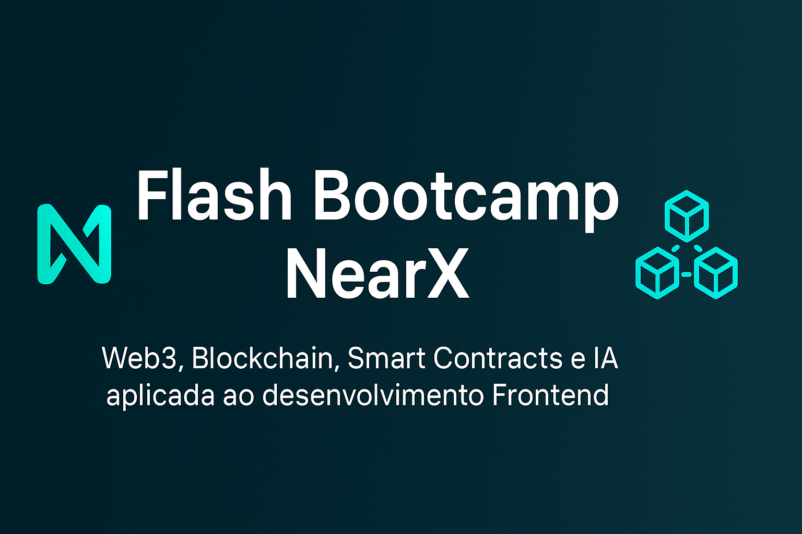

<!-- Banner -->
<p align="center">
  
</p>

<h1 align="center">⚡ Flash Bootcamp NearX</h1>
<h3 align="center">Seu Primeiro Projeto Web3 com Blockchain, Smart Contracts e IA</h3>

<p align="center">
  
  
</p>

<h2 align="center">📚 O que são Bootcamps</h2>

<p align="center">
Bootcamps são programas de treinamento intensivo e imersivo, com foco na prática, que visam desenvolver habilidades específicas em um curto período, como meses ou semanas. Eles são populares para quem busca uma mudança de carreira ou especialização rápida em áreas como tecnologia, onde o foco é em competências demandadas pelo mercado de trabalho.
</p>

---

## 🧭 Sumário
- [🌐 As Eras da Internet](#eras)
- [🧩 Tecnologias: Blockchain, Web3 e Smart Contracts](#tecnologias)
- [📘 Sobre o Projeto](#sobre)
- [🚀 O que você vai aprender](#aprender)
- [🧠 Tecnologias Utilizadas](#usadas)
- [⚙️ Como Executar](#executar)
- [💬 Comunidade NearX](#comunidade)
- [🧾 Licença](#licenca)

---

## 🌐 As Eras da Internet <a id="eras"></a>

A internet evoluiu em **três grandes fases**, cada uma marcada por uma forma diferente de **interação, criação e controle de informação**.  
Clique abaixo para explorar cada era 👇

---

<details>
<summary>📜 <strong>Era 1.0 — A Internet Estática (Anos 1990 – início 2000)</strong></summary>

### 💡 O que era
A primeira fase da internet: **sites estáticos**, apenas informativos e com comunicação **unidirecional** (empresa → usuário).

### ⚙️ Características
- Páginas em **HTML puro**, sem interatividade.  
- O usuário apenas **consumia conteúdo**.  
- Informação publicada por poucas fontes.  
- Design simples e navegação limitada.  

### 💻 Exemplos
- 🌐 **Yahoo**, **GeoCities**, **AltaVista**, **MSN**, portais de notícias.  
- 📰 Sites institucionais com texto e imagens fixas.  

> 🕹️ **Resumo:** o usuário era apenas um espectador.

</details>

---

<details>
<summary>💬 <strong>Era 2.0 — A Internet Interativa e Social (2004 – presente)</strong></summary>

### 💡 O que é
A era da **participação e colaboração**.  
O usuário passa a **criar, comentar e compartilhar** conteúdo — nasce a web **social** e **colaborativa**.

### ⚙️ Características
- Comunicação **de muitos para muitos**.  
- **Redes sociais**, **blogs**, **wikis** e **aplicativos web**.  
- Plataformas e dados centralizados em grandes empresas.  
- Uso intensivo de **APIs** e **nuvem**.  

### 💻 Exemplos
- 💬 **Facebook**, **YouTube**, **Instagram**, **Twitter (X)**, **Wikipedia**, **Spotify**, **Uber**.  

> 🌍 **Resumo:** o usuário virou parte ativa da internet — criador, influenciador e consumidor.

</details>

---

<details>
<summary>🪙 <strong>Era 3.0 — A Internet Descentralizada (Web3 – atual e futura)</strong></summary>

### 💡 O que é
A nova era da **internet descentralizada**, baseada em **blockchain**, **inteligência artificial** e **propriedade digital**.  
O usuário **recupera o controle sobre seus dados e ativos digitais**.

### ⚙️ Características
- Uso de **blockchain**, **IA** e **smart contracts**.  
- **Descentralização**: sem empresas intermediárias.  
- **Propriedade digital** via tokens e NFTs.  
- Aplicativos **dApps** e economias digitais.  

### 💻 Exemplos
- 🦊 **MetaMask**, 🌐 **Ethereum**, 🎨 **OpenSea**, 🏙️ **Decentraland**, 🪙 **Uniswap**, 🧭 **Lens Protocol**, 🔒 **Brave Browser**.  

> 🚀 **Resumo:** o usuário é dono dos seus dados, da sua identidade e da sua economia digital.

</details>

---

> 💬 **Resumo geral:**
> - 📜 **Web 1.0:** leitura → o usuário **consumia**.  
> - 💬 **Web 2.0:** leitura e escrita → o usuário **interagia**.  
> - 🪙 **Web 3.0:** leitura, escrita e propriedade → o usuário **controla**.

---

✨ *"Da informação à descentralização — a internet evolui para devolver o poder ao usuário."*

---

## 🧩 Tecnologias: Blockchain, Web3 e Smart Contracts <a id="tecnologias"></a>

Três pilares fundamentais da **era digital descentralizada**.  
Abaixo, você pode expandir cada seção para entender **o que é**, **para que serve** e **onde se aplica**.

---

<details>
<summary>🧱 <strong>Blockchain</strong> — o alicerce da confiança digital</summary>

### 💡 O que é
Um **registro descentralizado e criptografado**, que armazena dados em blocos interligados e imutáveis.

### ⚙️ Para que serve
Garante **segurança**, **transparência** e **integridade** nas transações e registros, sem depender de intermediários.

### 🚀 Onde é aplicada
- 💰 Criptomoedas  
- 🧾 Rastreabilidade de produtos  
- 🗳️ Votação digital  
- 🧑‍💻 Identidade digital  
- 📜 Registros públicos  

### 🔗 Recursos
- [📘 Blockchain.com Academy](https://www.blockchain.com/learning-portal)  
- [📗 IBM Blockchain Essentials](https://developer.ibm.com/technologies/blockchain/)  
- [📙 Bitcoin Whitepaper (Satoshi Nakamoto)](https://bitcoin.org/bitcoin.pdf)  

</details>

---

<details>
<summary>🌍 <strong>Web3</strong> — a nova geração da internet</summary>

### 💡 O que é
A **nova geração da internet** baseada em **blockchain e descentralização**, permitindo que os usuários tenham mais controle sobre seus dados.

### ⚙️ Para que serve
Oferece **interações diretas** entre pessoas e aplicativos, sem depender de grandes plataformas centralizadas.

### 🚀 Onde é aplicada
- 🕹️ Aplicativos descentralizados (dApps)  
- 🪙 Finanças descentralizadas (DeFi)  
- 🎨 NFTs e metaverso  
- 🔐 Login com carteira digital  

### 🔗 Recursos
- [🌐 web3.js Documentation (Ethereum Foundation)](https://web3js.readthedocs.io/)  
- [🧭 Ethereum.org – What is Web3?](https://ethereum.org/en/web3/)  
- [🧰 Alchemy University – Web3 Learning Platform](https://university.alchemy.com/)  

</details>

---

<details>
<summary>🤖 <strong>Smart Contracts</strong> — automação e confiança em código</summary>

### 💡 O que é
**Programas autônomos** que executam acordos automaticamente quando condições pré-definidas são atendidas.

### ⚙️ Para que serve
**Automatizam contratos digitais**, garantindo que regras sejam cumpridas de forma segura, transparente e sem intermediários.

### 🚀 Onde é aplicada
- 🪙 DeFi  
- 🎨 NFTs  
- 📑 Acordos empresariais  
- 🛡️ Seguros digitais  
- 🕹️ Jogos blockchain  

### 🔗 Recursos
- [📜 Solidity Documentation](https://docs.soliditylang.org/)  
- [🧪 Hardhat Framework](https://hardhat.org/)  
- [🦊 MetaMask](https://metamask.io/)  
- [⚙️ OpenZeppelin Docs](https://docs.openzeppelin.com/contracts/)  

</details>

---

> 💬 **Resumo rápido:**
> - 🧱 **Blockchain** → base da confiança e segurança digital.  
> - 🌍 **Web3** → camada de interação descentralizada.  
> - 🤖 **Smart Contracts** → motor que automatiza tudo sem intermediários.

---

📚 **Dica Final:**  
Combine essas tecnologias para criar soluções completas:  
- Use **Blockchain** como base de dados segura;  
- Desenvolva **Smart Contracts** para automatizar regras;  
- Conecte tudo com **Web3**, através de carteiras e dApps.

> ✨ *"O futuro da internet é aberto, descentralizado e automatizado."*

---

## 📘 Sobre o Projeto <a id="sobre"></a>

Este repositório reúne o projeto desenvolvido durante o **Flash Bootcamp da NearX**, uma imersão prática para introdução ao ecossistema **Web3**, com integração de **Blockchain**, **Smart Contracts** e **Inteligência Artificial aplicada ao Front-end**.

O objetivo é demonstrar como unir tecnologias emergentes para criar aplicações descentralizadas (**dApps**) com **maior produtividade**, utilizando IA como aliada no desenvolvimento.

---

## 🚀 O que você vai aprender <a id="aprender"></a>

✅ Estrutura e funcionamento do **Blockchain**  
✅ Conceitos essenciais de **Smart Contracts**  
✅ Aplicação prática de **IA** para acelerar o Front-end  
✅ Ferramentas e fluxos de trabalho para **autonomia e eficiência** no desenvolvimento  

---

## 🧠 Tecnologias Utilizadas <a id="usadas"></a>

<p align="center">
  
  
  
  
  
  
  
  
  
</p>

<p align="center">
  <sub>Essas são as principais tecnologias aplicadas no desenvolvimento do projeto — do front-end à integração com Web3 e IA.</sub>
</p>

---

## ⚙️ Como Executar <a id="executar"></a>

1. **Clone o repositório**
   ```bash
   git clone https://github.com/seuusuario/flash-bootcamp-nearx.git

2. Acesse a pasta do projeto
   
   cd flash-bootcamp-nearx

3. Instale as dependências
   
   npm install

4. Inicie o servidor de desenvolvimento
  
  npm start

🧩 Estrutura do Projeto
📦 flash-bootcamp-nearx
┣ 📂 src
┃ ┣ 📜 index.html
┃ ┣ 📜 main.js
┃ ┣ 📜 style.css
┃ ┗ 📜 contract.js
┣ 📜 package.json
┣ 📜 README.md
┗ 📜 .gitignore

💬 Comunidade NearX <a id="comunidade"></a>

Faça parte da comunidade de desenvolvedores Web3, aprenda com especialistas e conecte-se com outros devs:

👉 NearX sem Discord

🧾 Licença <a id="licenca"> </a>

Este projeto foi desenvolvido para fins educacionais durante o Flash Bootcamp NearX.
O conteúdo é de uso livre para estudos e experimentação.

<p align="center"> <b>Desenvolvido com 💡 por Luciano Camargo – KarreiraDev Frontend</b><br/> <sub>Explorando o futuro da Web3 com Blockchain, Smart Contracts e IA.</sub> </p> <p align="center"> <a href="https://www.linkedin.com/in/seu-linkedin/">  </a> <a href="https://github.com/seu-usuario">  </a> </p>

<p align="center"> 🌙 <i>Projeto Flash Bootcamp NearX – Construindo o Futuro da Web3 com Código e Criatividade.</i> </p>